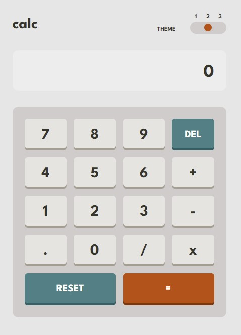

# Frontend Mentor - Calculator app solution

This is a solution to the [Calculator app challenge on Frontend Mentor](https://www.frontendmentor.io/challenges/calculator-app-9lteq5N29). Frontend Mentor challenges help you improve your coding skills by building realistic projects. 

## Table of contents

- [Overview](#overview)
  - [The challenge](#the-challenge)
  - [Screenshot](#screenshot)
  - [Links](#links)
- [My process](#my-process)
  - [Built with](#built-with)
  - [What I learned](#what-i-learned)
  - [Useful resources](#useful-resources)

## Overview

### The challenge

Users should be able to:

- See the size of the elements adjust based on their device's screen size
- Perform mathmatical operations like addition, subtraction, multiplication, and division
- Adjust the color theme based on their preference
- **Bonus**: Have their initial theme preference checked using `prefers-color-scheme` and have any additional changes saved in the browser

### Screenshot

### Links

- Solution URL: [Add solution URL here](https://your-solution-url.com)
- Live Site URL: [Add live site URL here](https://your-live-site-url.com)

## My process

### Built with

- [Vue.js](https://vuejs.org/)
- [Tailwind CSS](https://tailwindcss.com/)

### What I learned

For making this project I started by researching how calculators are made. What I found out was that the first step to building a calculator is to convert the input expression in infix (e.g. 2+4\*3) to another kind of notation called postfix (e.g. 2 4 3 \*+). In postfix notation the operators come after the operands and it's a good notation because it has no specific precedence of operators, the expression is calculated in the order it is written. Then I wrote a parser for the postfix notation to get the final result.

### Useful resources

- [stackoverflow - Smart design of a math parser](https://stackoverflow.com/questions/114586/smart-design-of-a-math-parser) - This helped as a starting point to what I should research further.
